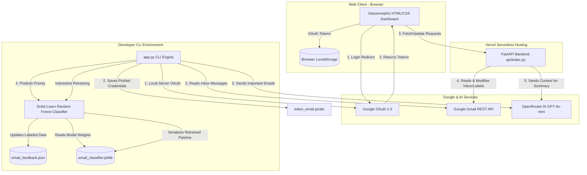

# 📧 AI Email Summarizer & Classifier

> A robust, dual-interface (Web Dashboard & CLI Client) AI-powered email intelligence platform. Connect securely to Gmail via OAuth 2.0, auto-classify incoming emails locally using a Random Forest machine learning pipeline, and generate structured summaries using LLMs via the OpenRouter API (GPT-4o-mini).

### 🌐 [Live Demo (Vercel) →](https://ai-email-summarizer-bflqemzrm-pro-gram.vercel.app/)

[](https://ai-email-summarizer-bflqemzrm-pro-gram.vercel.app/)
[](https://vercel.com/)
[](https://www.python.org/)
[](https://fastapi.tiangolo.com/)
[](https://scikit-learn.org/)
[](https://developers.google.com/gmail/api)
[](https://openrouter.ai/)
[](LICENSE)

---

## 🎯 Project Overview

Managing a busy inbox is time-consuming. **AI Email Summarizer & Classifier** streamlines this process by separating the noise from critical correspondence and delivering concise, actionable digests. It is designed to work in two modes:

1. **Production Serverless Web App:** A stateless Single Page Application (SPA) with a responsive glassmorphic dashboard hosted on Vercel. Authenticates users via Google OAuth 2.0, manages/syncs labels (Inbox, Junk, Important) directly with Gmail, and requests AI summaries on-demand.
2. **Local Machine Learning CLI Client:** A command-line companion that runs a local Python pipeline to pull messages, run them through a Scikit-Learn classifier to predict priority, and manage training/retraining of the model using historical user feedback logs.

---

## 🏗️ System Architecture

The diagram below outlines how the components interact in both the **Serverless Web App** mode and the **Local CLI Client** mode.



---

## ⚡ Features at a Glance

### 🌐 Web Dashboard (Glassmorphic SPA)
*   **Multi-Account Support:** Seamlessly add and switch between multiple Gmail accounts.
*   **Live Label Syncing:** Mark emails as "Important" or "Junk" in the UI, syncing instantly with Gmail labels.
*   **Actionable Summaries:** One-click generation of structured email digests (Bullet points, Insights, Action items).
*   **Starred Support:** Star and unstar emails with instant real-time backend updates.
*   **Real-time Search:** Instantly filter emails by sender, subject, or message body.
*   **Fully Responsive:** Glassmorphic layout crafted in HTML/Vanilla CSS optimized for all viewports.

### 💻 Command Line Interface (Local CLI)
*   **Automated Classification:** Uses a local supervised machine learning model to categorize your fetched emails as "Important" or "Junk".
*   **Feedback & Retraining:** Interactive console commands to log user preferences and retrain the classifier pipeline.
*   **Granular Commands:** Limit fetched counts, bypass summaries with flags, and choose to summarize all emails or only those auto-classified as important.

---

## 🤖 Local Machine Learning Classifier

The local CLI mode integrates a custom Scikit-Learn Natural Language Processing (NLP) pipeline to automate email sorting:

*   **Pipeline Setup:** Features a `TfidfVectorizer` (with bigrams and English stop-word filtering) connected to a `RandomForestClassifier` (100 estimators, balanced class weights).
*   **Input Features:** Joins the email's Subject, Sender (`From` header), and message body to form a complete text representation.
*   **Self-Improving Loop:**
    *   Manual classification reviews from users can be stored in the training corpus (`email_feedback.json`).
    *   Running the CLI with the `--retrain` flag fits the vectorizer and classifier on the updated feedback dataset, generating a newly serialized `email_classifier.joblib` pipeline weights file.

---

## 🛠️ Technical Stack

### Backend & Core
*   **FastAPI:** High-performance Python web framework for serverless backend API routing.
*   **Uvicorn:** ASGI web server implementation used for local development.
*   **Google API Python Client:** Connects to the Gmail REST endpoints (`messages.list`, `messages.get`, `messages.modify`).
*   **Google Auth Library:** Implements the secure OAuth 2.0 authorization code exchange flow.
*   **BeautifulSoup4:** Parsers to strip HTML content from rich email bodies for clean text processing.

### Frontend
*   **Vanilla JS (ES6+):** Single Page Application routing, DOM updates, API interactions, and state management.
*   **Glassmorphic CSS3:** Tailored styling, smooth animations, visual card layouts, and responsive elements.
*   **LocalStorage:** Client-side token storage ensuring the server remains stateless.

### Machine Learning (Local CLI)
*   **Scikit-Learn:** Machine learning pipeline (`TfidfVectorizer` + `RandomForestClassifier`).
*   **Joblib:** Serialization tool for saving and loading the trained model pipeline on disk.
*   **NumPy:** Linear algebra backend for confidence scores and classification probabilities.

---

## ⚙️ Getting Started & Setup

### Step 1: Google Cloud Console OAuth Setup
To connect to the Gmail API, you must obtain client credentials:
1.  Go to the [Google Cloud Console](https://console.cloud.google.com/).
2.  Create a new project.
3.  Navigate to **APIs & Services > Library**, search for the **Gmail API**, and click **Enable**.
4.  Set up the **OAuth Consent Screen** (choose User Type: **External**), and register your Gmail address as a **Test User** (required while the app is in testing status).
5.  Navigate to **APIs & Services > Credentials** and click **Create Credentials > OAuth Client ID**.
6.  Select Application Type: **Web application**.
7.  Add the following **Authorized Redirect URIs**:
    *   Local Development: `http://localhost:8000/api/oauth_callback`
    *   Production: `https://your-app-name.vercel.app/api/oauth_callback`
8.  Click **Create** and download the client configuration JSON file. Rename this file to `credentials.json` and place it in your project's root folder.

### Step 2: Setting Up Environment Variables
Create a `.env` file in the project root to support local runs:
```env
OPENROUTER_API_KEY=your_openrouter_api_key_here
# If deploying to Vercel, convert credentials.json to a single-line string:
GOOGLE_CREDENTIALS_JSON={"web":{"client_id":"..."}}
```
> [!TIP]
> To convert your `credentials.json` into a single-line string, use these quick terminal commands:
> *   **PowerShell:** `(Get-Content credentials.json -Raw) -replace "\r?\n",""`
> *   **Bash:** `tr -d '\r\n' < credentials.json`

---

## 🚀 Running the Web App

### Option A: Local Run (FastAPI + Uvicorn)
1.  Clone the repository and install the standard dependencies:
    ```bash
    pip install -r requirements.txt
    ```
2.  Run the application using Uvicorn:
    ```bash
    uvicorn api.index:app --reload --port 8000
    ```
3.  Open your browser and navigate to `http://localhost:8000`.

### Option B: Deploying to Vercel (Production)
The project is configured for Vercel's serverless runtime using `vercel.json` rewrites.
1.  Push the project to GitHub (make sure to exclude `credentials.json` and `.env` in your `.gitignore`).
2.  Import the repository into Vercel.
3.  Configure the **Environment Variables** in the Vercel Project Settings:
    *   `OPENROUTER_API_KEY`
    *   `GOOGLE_CREDENTIALS_JSON` (the single-line client configuration)
4.  Deploy!

---

## 💻 Running the Local CLI Client

The CLI uses the local machine learning pipeline to auto-sort your emails.

### 📥 Install CLI Dependencies
Because the serverless web backend doesn't require ML libraries, package dependencies like `scikit-learn`, `numpy`, and `joblib` are not in the main `requirements.txt`. Install them manually for CLI usage:
```bash
pip install scikit-learn numpy joblib
```

### 🏃‍♂️ CLI Commands & Options
Run the CLI using `python app.py`. The interface will guide you through selecting accounts or setting up a new login.

```bash
# Fetch and summarize the latest 5 emails (Important only by default)
python app.py

# Fetch the latest 15 emails from a specific account
python app.py --limit 15 --account user@gmail.com

# Fetch and auto-classify emails but skip the OpenRouter AI summary
python app.py --no-summary

# Fetch emails and include all of them in the AI summary (skipping classification filter)
python app.py --all

# Retrain the Scikit-Learn Random Forest model using the manual feedback logs
python app.py --retrain
```

### 📋 CLI Command Line Reference
| Flag / Argument | Type | Default | Description |
| :--- | :--- | :--- | :--- |
| `-l`, `--limit` | Integer | `5` | Set the number of emails to fetch (Range: 1–100). |
| `-a`, `--account` | String | `None` | Target a specific Gmail address from your authenticated local accounts. |
| `-n`, `--no-summary`| Flag | `False` | Run fetch and classification, but bypass sending the request to OpenRouter. |
| `--all` | Flag | `False` | Sends all fetched emails to the summarizer, bypassing the "Important" filter. |
| `-r`, `--retrain` | Flag | `False` | Bypasses inbox fetching and immediately retrains the classifier on feedback data. |

---

## 🧪 Running Tests
The project features a full test suite checking classifications, feedback managers, and summarization integration. You can run the test suite locally using:
```bash
python -m unittest test_email_summarizer.py
```

---

## 🔒 Security & Privacy

*   **Stateless Operations:** User OAuth tokens are never stored in a backend database. In the web dashboard, they reside strictly in the browser's `localStorage`. In the CLI, they are saved as pickled local files (`token_email.pickle`) on the user's machine.
*   **Minimal Permissions Scope:** The application requests the minimum scopes required for reading and organizing labels (`gmail.readonly` and `gmail.modify`). It is not granted permissions to delete messages.
*   **No Data Ingestion:** Your email contents are parsed, cleaned, and directly passed to Google or OpenRouter. None of your data is logged, sold, or cached.

---

## 🔧 Troubleshooting

| Problem | Cause | Solution |
| :--- | :--- | :--- |
| `redirect_uri_mismatch` | Google client redirect URI does not match the page host. | Update the OAuth Client ID in Google Cloud Console with the exact domain URL: `https://your-domain.vercel.app/api/oauth_callback`. |
| `Error 401: deleted_client` | Google OAuth Client ID has been deleted or is invalid. | Re-create credentials, update the credentials file, or set `GOOGLE_CREDENTIALS_JSON` environment variable. |
| **"App not verified" screen** | Google app is in testing/development state. | Click **Advanced > Go to [App Name] (unsafe)** to proceed. This is standard behavior for sandbox environments. |
| **Emails fail to fetch** | OAuth refresh token has expired or is invalid. | Remove the credentials locally/clear localStorage and trigger the Google OAuth login flow again to refresh permissions. |
| `ModuleNotFoundError` on CLI | Missing local ML dependencies. | Run `pip install scikit-learn numpy joblib` before using the CLI. |

---

## 📄 License
This project is licensed under the MIT License. See the [LICENSE](LICENSE) file for details.

---
<div align="center">
  <sub>FastAPI • Python • Google APIs • Scikit-Learn • OpenRouter AI • Vanilla JS • Vercel</sub>
</div>
